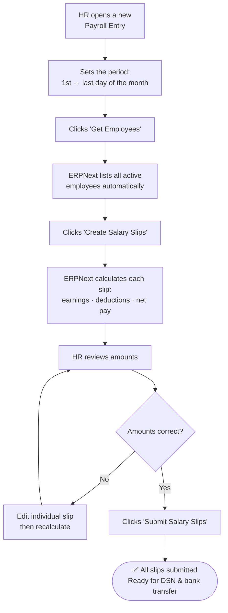

# DSN Monthly Declaration — User Guide

:::info Audience
This guide is for the **HR and payroll team**. No technical knowledge required. The IT team has already set everything up — your job is to follow the steps below once a month.
:::

---

## What is DSN?

**DSN (Déclaration Sociale Nominative)** is the mandatory monthly declaration that every French employer must send to social security organisations (URSSAF, retraite complémentaire, prévoyance, etc.).

It replaces all the old individual declarations (DUCS, DADS, CIBTP, etc.) with a single file generated automatically from your payroll data.

| Old way | New way with DSN |
|---|---|
| 6–10 separate declarations per month | 1 single file, sent automatically |
| Manual data entry, risk of errors | Generated directly from salary slips |
| Sent by post or separate portals | Sent electronically in seconds |

---

## Who does what

| Role | Responsibility |
|---|---|
| **HR / Payroll manager** | Runs payroll, verifies slips, submits DSN |
| **Finance / Accounting** | Validates gross amounts, approves bank transfer |
| **IT team** | Maintains the system — no monthly action required |

---

## Monthly calendar — salaries paid on the 17th

```mermaid
gantt
    title Payroll & DSN — Monthly timeline (salary paid 17th)
    dateFormat DD
    axisFormat %d

    section Payroll preparation
    Collect variable data (absences, bonuses)  :active, 01, 10d
    Run payroll entry in ERPNext               :11, 3d
    Finance review & approval                  :14, 2d

    section Salary payment
    Submit salary slips                        :milestone, 16, 0d
    💶 Salary paid to employees               :milestone, 17, 0d

    section DSN declaration
    Submit DSN to social security              :18, 5d
    ⏰ Legal deadline (>50 employees)         :milestone, 05, 0d
```

:::note Reading the calendar
The Gantt above shows one month. "Day 05" in the DSN section refers to the **5th of the following month** — the legal deadline. For companies with 50 employees or fewer, the deadline is the **15th of the following month**.
:::

---

## How is a salary slip generated?

Salary slips are **not created one by one**. ERPNext generates them all at once from a **Payroll Entry** — a single form that covers all employees for a given month.

Each slip is calculated automatically based on:
- The employee's **salary structure** (base salary, standard deductions) set up in their HR file
- Any **variable elements** entered that month (bonus, absence deduction, overtime)

The HR manager only needs to check the final numbers — all the maths is done by ERPNext.

---

## The full monthly process — step by step

### Step 1 — Prepare variable payroll data (1st–10th)

Before running payroll, collect for each employee:
- Absences (days off without pay, sick leave not covered, etc.)
- Bonuses or one-off payments
- Any changes to hours or contract

Enter these in ERPNext under **HR** → **Leave Application** (absences) or directly on the Payroll Entry as additional earnings/deductions.

---

### Step 2 — Run the Payroll Entry (11th–13th)

1. Log in to ERPNext at **[erp.devandre.sbs](https://erp.devandre.sbs)**
2. Go to **Payroll** → **Payroll Entry** → **New**
3. Fill in:
   - **Company**: ktayl solution
   - **Start Date**: 1st of the month (e.g. 01/01/2026)
   - **End Date**: last day of the month (e.g. 31/01/2026)
   - **Payroll Frequency**: Monthly
   - **Payment Account**: the company bank account
4. Click **Get Employees** — ERPNext automatically lists all active employees
5. Click **Create Salary Slips** — one slip is generated per employee

:::info What ERPNext calculates automatically
For each employee, ERPNext applies their salary structure:
- **Gross pay** = base salary + bonuses
- **Deductions** = retraite complémentaire, CSG/CRDS, mutuelle, etc.
- **Net pay** = what the employee receives on the 17th
:::

---

### Step 3 — Review and approve (14th–15th)

Open each salary slip from the Payroll Entry to verify:
- Gross pay is correct
- Deductions are as expected
- Net pay matches what will be transferred to the employee's bank account

If a figure is wrong: open the individual slip → amend → save → recalculate.

Once all amounts are confirmed, Finance validates the total payroll cost.

---

### Step 4 — Submit salary slips (16th — day before payment)

Back on the Payroll Entry:

1. Click **Submit Salary Slips** — all slips move from Draft to Submitted
2. Click **Create Bank Entry** — ERPNext generates the accounting entry for the salary transfer

:::warning
A slip must be **Submitted** before it is included in the DSN. Slips in Draft status are invisible to the declaration system.
:::

---

### Step 5 — 💶 Salary payment (17th)

The Finance team initiates the bank transfer for the total net payroll. Employees receive their salary on the 17th.

---

### Step 6 — Submit the DSN (18th – 5th of following month)

Once salaries are paid, submit the declaration:

1. Go to **Payroll** → **Payroll Entry** — open the entry for the month
2. In the top-right menu, click **Submit DSN**
3. A confirmation pop-up shows:
   - Number of employees included
   - Any warnings (missing employee data)
4. Click **Confirm**

ERPNext will:
- Collect all submitted salary slips for the month
- Generate the DSN file automatically
- Send it to the declaration system
- Save the confirmation receipt on the Payroll Entry

---

### Step 7 — Check the result

Open the Payroll Entry. At the bottom, under **Comments**, you will see:

> **DSN 01/2026 — ✅ Acceptée**
> Soumis le: 2026-02-03T09:14:32Z
> Identifiant envoi: A3F7C291
> Individus: 1 | Déclarations: 1

**Your work for the month is done.**

If you see ❌ Rejetée, see the next section.

---

## If the declaration is rejected

A rejection means the file had a structural problem. This is rare — see the table below to know who acts.

**What to do:**
1. Take a screenshot of the red comment (the error message)
2. Send it to the IT team
3. The IT team corrects the issue and resubmits on your behalf

**Who fixes what:**

| Error message | Meaning | Who fixes it |
|---|---|---|
| Bloc obligatoire absent | File structure issue | IT team |
| Version norme invalide | Software configuration issue | IT team |
| NIR manquant | Social security number missing on employee record | **HR team** |
| Date de naissance manquante | Date of birth missing on employee record | **HR team** |

---

## Employee file — required fields for DSN

Each employee must have the following filled in ERPNext **before their first payroll run**:

| Field | What it is | Where to find it |
|---|---|---|
| NIR | Social security number (15 digits) | Employee's *carte Vitale* or previous payslip |
| Date of birth | Date de naissance | ID document or employment contract |
| Gender | Sexe | ID document |
| Date of joining | Date d'entrée dans l'entreprise | Employment contract |
| Employment type | CDI, CDD, Alternance, etc. | Employment contract |

To update: **HR** → **Employee** → search by name → edit and save.

---

## Full monthly timeline at a glance

| Date | Action | Who |
|---|---|---|
| 1st–10th | Collect absences, bonuses, variable data | HR |
| 11th–13th | Create Payroll Entry, generate salary slips | HR |
| 14th–15th | Review amounts, Finance approves | HR + Finance |
| **16th** | Submit all salary slips in ERPNext | HR |
| **17th** | 💶 Salary transferred to employees | Finance |
| 18th–5th (next month) | Submit DSN declaration | HR |
| **5th (next month)** | ⏰ Legal DSN deadline (> 50 employees) | — |
| **15th (next month)** | ⏰ Legal DSN deadline (≤ 50 employees) | — |

:::tip Set recurring tasks in Plane
- Task on the **11th**: *"Run payroll for [month]"* → HR manager
- Task on the **16th**: *"Submit salary slips — payment tomorrow"* → HR manager
- Task on the **18th**: *"Submit DSN for [month]"* → HR manager
:::

---

## Frequently asked questions

**Can I resubmit a DSN after a correction?**
Yes. If a salary slip is amended after submission, contact IT with the employee name and the correction. The IT team generates a corrective DSN (DSN de substitution).

**What if an employee is missing from the DSN?**
Their salary slip was not submitted. Check the slip in ERPNext — if it shows "Draft", submit it and then ask IT to resubmit the DSN.

**Is the DSN the same as the payslip the employee receives?**
No. The payslip (bulletin de salaire) is what you give the employee. The DSN is the declaration sent to social security on behalf of the company. They use the same salary data but are completely separate documents.

**Who receives the DSN?**
The declaration system forwards it automatically to URSSAF, pension funds (retraite complémentaire), and provident insurance (prévoyance).

**Can I check past declarations?**
Yes. **Payroll** → **Payroll Entry** → open any past month → scroll to **Comments** to see the submission confirmation and reference number.

**What if the 17th falls on a weekend or bank holiday?**
Pay on the last working day before the 17th. The Payroll Entry dates and DSN period remain unchanged (1st–last day of the month).
