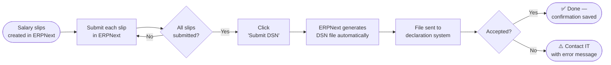

# DSN Monthly Declaration — User Guide

:::info Audience
This guide is for the **HR and payroll team**. No technical knowledge required. The IT team has already set everything up — your job is simply to follow the steps below once a month.
:::

---

## What is DSN?

**DSN (Déclaration Sociale Nominative)** is the mandatory monthly declaration that every French employer must send to social security organisations (URSSAF, retraite complémentaire, prévoyance, etc.).

It replaces all the old individual declarations (DUCS, DADS, CIBTP, etc.) with a single file generated automatically from your payroll software.

| Old way | New way with DSN |
|---|---|
| 6–10 separate declarations per month | 1 single file, sent automatically |
| Manual data entry, risk of errors | Generated directly from salary slips |
| Sent by post or separate portals | Sent electronically in seconds |

The legal deadline for most companies is the **5th of the month following the payroll period** (or the 15th for companies with fewer than 50 employees).

---

## Who does what

| Role | Responsibility |
|---|---|
| **HR / Payroll manager** | Creates and submits salary slips in ERPNext |
| **Finance / Accounting** | Verifies gross amounts before submission |
| **IT team** | Maintains the system — no monthly action required |

---

## The monthly process

---

## Step-by-step: what to do each month

### Step 1 — Create salary slips (by the last working day of the month)

1. Log in to ERPNext at **[erp.devandre.sbs](https://erp.devandre.sbs)**
2. Go to **Payroll** → **Salary Slip**
3. Create a salary slip for each employee for the month
4. Verify the amounts (gross pay, deductions)
5. Click **Submit** on each slip

:::warning Important
A salary slip must be in **Submitted** status (shown in blue) before it is included in the DSN. Draft slips are ignored.
:::

### Step 2 — Submit the monthly DSN (by the 5th of the following month)

Once all salary slips for the month are submitted:

1. Go to **Payroll** → **Payroll Entry** — open the entry for the month
2. In the top-right menu, click **Submit DSN**
3. A confirmation pop-up will show:
   - Number of employees included
   - Any warnings (e.g. missing information on an employee file)
4. Click **Confirm**

ERPNext will:
- Collect all submitted salary slips for the month
- Generate the DSN file automatically
- Send it to the declaration system
- Save the confirmation receipt

### Step 3 — Check the result

After submission, open the Payroll Entry for the month. At the bottom of the page, under **Comments**, you will see a message like:

> **DSN 01/2026 — ✅ Acceptée**
> Soumis le: 2026-02-03T09:14:32Z
> Identifiant envoi: A3F7C291
> Individus: 1 | Déclarations: 1

This means the declaration was accepted. **Your work for the month is done.**

If you see ❌ Rejetée, see the section below.

---

## If the declaration is rejected

A rejection means the file had a structural problem. This is rare and is always an IT issue, not a payroll data issue.

**What to do:**
1. Copy the full content of the red comment (the error message)
2. Send it to the IT team
3. The IT team will correct the issue and resubmit on your behalf

**Common reasons for rejection and who fixes it:**

| Message | Meaning | Who fixes it |
|---|---|---|
| Bloc obligatoire absent: S10.G00.00 | File header missing | IT team |
| Version norme invalide | Software version issue | IT team |
| NIR manquant sur la fiche employé | Employee social security number missing | **HR team** — add NIR to the employee record |
| Date de naissance manquante | Employee date of birth missing | **HR team** — add to employee record |

---

## Employee file — required fields for DSN

Each employee must have the following fields filled in ERPNext **before** their first salary slip is submitted:

| Field in ERPNext | What it is | Where to find it |
|---|---|---|
| NIR | Social security number (15 digits) | Employee's *carte Vitale* or pay slip from previous employer |
| Date of birth | Date de naissance | Employee ID or contract |
| Gender | Sexe | Employee ID |
| Date of joining | Date d'entrée dans l'entreprise | Employment contract |
| Employment type | CDI, CDD, Alternance, etc. | Employment contract |

To update an employee record: **HR** → **Employee** → search the employee's name → edit and save.

---

## Calendar reminder

| Action | Deadline |
|---|---|
| All salary slips submitted | Last working day of the month |
| DSN submitted | **5th of the following month** (companies > 50 employees) |
| DSN submitted | **15th of the following month** (companies ≤ 50 employees) |

:::tip Set a recurring task
Add a recurring task in Plane on the 1st of each month: *"Submit DSN for [previous month]"* — assigned to the payroll manager.
:::

---

## Frequently asked questions

**Can I resubmit a DSN after a correction?**
Yes. If a salary slip is amended after submission, the IT team can generate a corrective DSN (DSN de substitution). Contact IT with the employee name and the correction details.

**What if an employee is missing from the DSN?**
Their salary slip was not submitted before the DSN was sent. Check the slip status in ERPNext — if it shows "Draft", submit it and then ask IT to resubmit the DSN.

**Is the DSN the same as the payslip sent to the employee?**
No. The payslip (bulletin de salaire) is the document given to the employee. The DSN is the declaration sent to social security on behalf of the employer. They contain the same salary data but are completely separate documents.

**Who receives the DSN?**
The declaration system forwards it automatically to URSSAF, the pension funds (retraite complémentaire), and the provident insurance (prévoyance) — depending on which organisations your company is registered with.

**Can I check past declarations?**
Yes. Go to **Payroll** → **Payroll Entry** → open any past month → scroll to **Comments** at the bottom to see the submission confirmation and reference number.
