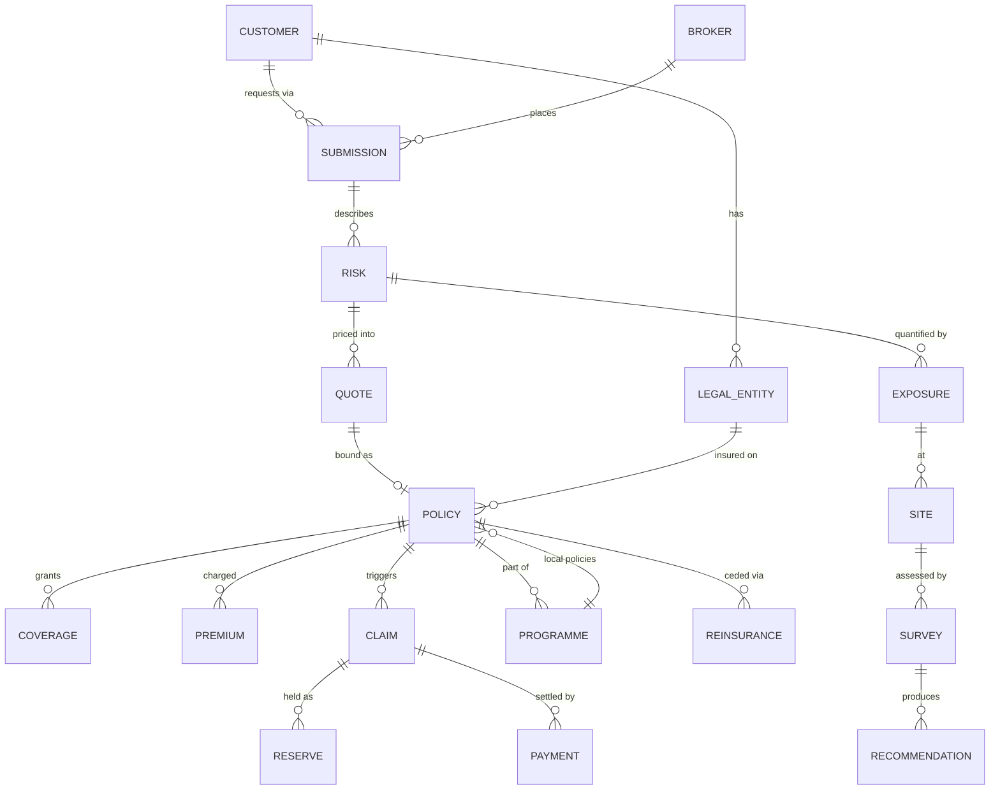

# Canonical Insurance Data Model — ktayl IS

> The **shared business model every domain builds against**. One definition of Customer, Policy, Claim…
> so APIs, integrations, reporting, AI and audit all speak the same language. This is the *conceptual*
> model (entities + relationships + the **system of record** that owns each); each domain service keeps
> its own physical schema but **must not redefine these core entities** — it references them by the
> canonical identifier. Companion: [System of Record](./system-of-record) · [Capability Map](./capability-map).

:::note Two-layer model
This models the **ktayl-solution IS** (the insurer). **Retrieva** is a separate product and is not part
of this model — though its graph *pattern* is reused for portfolio accumulation (see [Capability Map](./capability-map)).
:::

## 1. The core entity graph

## 2. Entities — definition, key attributes, system of record

| Entity | What it is | Key attributes | System of Record | SoR status |
|---|---|---|---|---|
| **Customer** | The insured corporate group (top of hierarchy) | globalCustomerId, name, industry, revenue, country | CRM / MDM | 🔴 none yet |
| **LegalEntity** | A subsidiary/entity of the customer (per-country) | entityId, customerId, country, LEI, admittedStatus | CRM / MDM | 🔴 none yet |
| **Broker** | The intermediary placing business | brokerId, name, country, commissionTerms | CRM | 🔴 none yet |
| **Submission** | A request to quote (new business / renewal) | submissionId, customerId, brokerId, LOB, status | Submission Hub | 🔴 not built |
| **Risk** | The insurable object/activity assessed | riskId, submissionId, class, occupancy | Underwriting | 🟡 scaffold |
| **Exposure** | The quantified size of a risk | TIV, PML, MFL, BI value, catZone | Underwriting | 🟡 scaffold |
| **Site** | A physical location of exposure | siteId, address, geo, occupancy | Underwriting / Risk Eng | 🟡 scaffold |
| **Quote** | Priced terms offered | quoteId, riskId, premium, limits, deductibles | Underwriting | 🟡 scaffold |
| **Policy** | The bound contract (the spine) | policyId, entityId, inception, expiry, status | **Policy Admin** | 🟢 **live** (ktayl-policy-service) |
| **Coverage** | A granted cover within a policy | coverageId, policyId, limit, deductible, clauses | Policy Admin | 🟢 live |
| **Premium** | Amounts charged for a policy | premiumId, policyId, gross, tax, installments | Billing | 🔴 not built |
| **Claim** | A loss event against a policy | claimId, policyId, event, status, cause | Claims | 🟡 scaffold |
| **Reserve** | Money set aside for a claim | reserveId, claimId, type, amount | Claims / Actuarial | 🟡 scaffold |
| **Payment** | Cash out (claim) or in (premium) | paymentId, ref, amount, currency, date | Finance (ERPNext) | 🟡 partial |
| **Programme** | An international master + local policies | programmeId, masterPolicyId, countries | International Programmes | 🟡 scaffold |
| **Reinsurance** | Treaty/fac cession of a risk | contractId, type, cededShare, reinsurer | Reinsurance | 🟡 scaffold |
| **Survey** | A risk-engineering site assessment | surveyId, siteId, engineer, date, score | Risk Engineering | 🟡 scaffold |
| **Recommendation** | A prevention action from a survey | recId, surveyId, severity, dueDate, status | Risk Engineering | 🟡 scaffold |

## 3. The three rules

1. **One canonical identifier per entity** — a domain references `policyId` / `globalCustomerId`, it does
   not mint its own. This is what MDM (customer/entity/broker) exists to guarantee.
2. **The SoR owns writes; everyone else holds read projections** — e.g. Claims reads Policy via the Policy
   API, never writes policy data.
3. **Cross-domain joins happen in the Data Platform, not by reaching into another domain's database**
   (no shared operational DB — blueprint ADR-005).

## 4. Why this matters against the industry problems

- **P1 insurability / P3 accumulation** need `Site` + `Exposure` + `Coverage` joined across the whole
  portfolio — impossible without a canonical `Site`/`Exposure` shared by Underwriting, Risk Engineering
  and the Data Platform. The canonical model is the precondition for accumulation analysis.
- **P2 margin** needs `Premium` + `Claim` + `Reserve` joined by `policyId` for loss-ratio/combined-ratio —
  which only works if all three domains use the same `policyId`.

## 5. Status

The model is **defined**; only **Policy + Coverage have a live SoR** today. The rest are owned by
scaffold/gap domains — so the immediate foundation work is **MDM (Customer/Entity/Broker) + a canonical
`Site`/`Exposure`**, which unlock the analytics that attack P1/P2/P3. See [Capability Map](./capability-map) §roadmap.
