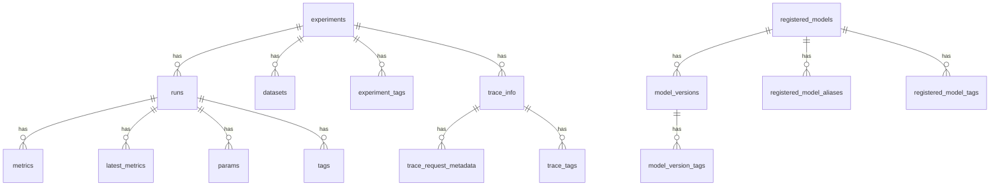
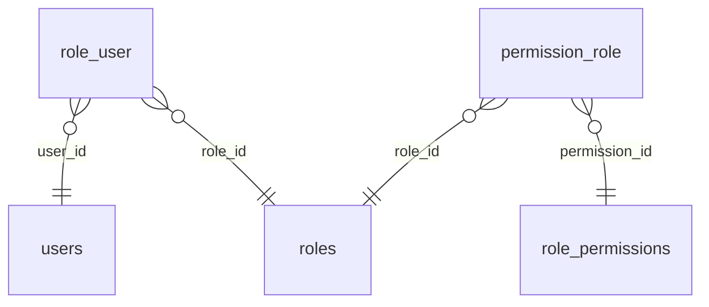

# Schema diagrams — auto-generated, CI-gated against drift

:::note Generated from reality, never hand-drawn
None of these diagrams were drawn by hand. Each is produced by `tbls` reading a **real schema** — either
built from the repo's **migrations** in CI (the fleet index
below), or reverse-engineered from a **live DB** for adopted/vendor schemas. The example below was read
from the live `mlflow` PostgreSQL database (on `postgresql-ai`) inside the cluster using existing
credentials — **nothing was uploaded to any third-party service**. Snapshot: **2026-10-06**. Companion to
the [Data stores inventory](data-stores-inventory) (which lists *where* every database is — this shows
*what's inside* them).
:::

## Example — the MLflow tracking database

**How to read it:** each line is a real relationship found in the database; `||--o{` means
**"one has many."** So an **experiment** has many **runs**; each **run** has many **metrics**,
**params** and **tags**; a **registered_model** has many **model_versions**; a **trace** has many
**tags/metadata**. That is exactly how MLflow stores experiment-tracking data — discovered
automatically, not documented by hand.

## Why generate diagrams this way

| Hand-drawn diagram | Reverse-engineered (this) |
|---|---|
| Correct the day it's drawn, then **rots** on the next migration | **Always matches reality** — re-reads the live schema |
| Lives in someone's desktop tool, unversioned | **Committed to Git**, rendered on this site |
| Manual effort per change | Regenerated in seconds / in CI |

## Pilot done — `tbls`, both engines ✅

The intro diagram above was first hand-built via SQL to prove the idea; the generation is now done
properly with [`tbls`](https://github.com/k1LoW/tbls), piloted across **both database engines** we run:

- **Postgres** — `mlflow` (19 tables): full column-level ERD with exact FK rules (incl. `ON UPDATE/DELETE CASCADE`).
- **MySQL/MariaDB** — `BookStack` (~40 tables): `tbls` produced entities **with columns + types + PK markers**
  plus the role/permission relationships, e.g.:

The reusable generator is committed at **`minicloud-ops/scripts/db-erd/generate-erd.sh`** — it
reverse-engineers any live Postgres/MySQL DB over a `kubectl port-forward` (creds read from the k8s
Secret at runtime, nothing uploaded). `tbls` also emits richer **per-table Markdown pages** and a
`tbls diff` **drift-check**.

## Live across the fleet ✅ (done 2026-10-06)

Every DB-owning repo now carries an **always-fresh ER doc committed under `docs/data-model/`** plus a
`schema-erd-drift` **CI job** that regenerates it from the repo's migrations and **fails the build if the
committed doc drifted** — so the docs can't lie. The ERDs below are generated from the **migrations**
(the same source of truth as production), not hand-drawn. Each link opens the committed `README.md`, whose
Mermaid ER diagram **renders natively on GitHub**. The standard is now enforced constitution:
[`schema-erd.md`](https://github.com/andrelair-platform/minicloud-gitops/blob/main/.claude/rules/schema-erd.md).

| Repo | Migration toolchain | Tables | Committed ERD |
|---|---|---:|---|
| ktayl-core | Flyway | 5 | [docs/data-model](https://github.com/andrelair-platform/ktayl-core/blob/main/docs/data-model/README.md) |
| ktayl-claims | Flyway | — | [docs/data-model](https://github.com/andrelair-platform/ktayl-claims/blob/main/docs/data-model/README.md) |
| ktayl-underwriting | Alembic | 8 | [docs/data-model](https://github.com/andrelair-platform/ktayl-underwriting/blob/main/docs/data-model/README.md) |
| ktayl-iam | TypeORM | 6 | [backend/docs/data-model](https://github.com/andrelair-platform/ktayl-iam/blob/main/backend/docs/data-model/README.md) |
| ktayl-policy-service | golang-migrate | 5 | [docs/data-model](https://github.com/andrelair-platform/ktayl-policy-service/blob/main/docs/data-model/README.md) |
| retrieva-backend | Drizzle | 24 | [docs/data-model](https://github.com/andrelair-platform/retrieva-backend/blob/main/docs/data-model/README.md) |
| ktayl-data-platform | **dbt (carve-out)** | — | self-documented by committed dbt **model contracts** (`models/**/_*.yml`) + CI `dbt parse` — tbls is the wrong tool for a *derived* warehouse (not a migration-owned schema) |

**Two generation modes** (both committed, both drift-gated):

- **Migration-sourced (the 6 `tbls` repos above — all but ktayl-data-platform)** — CI applies the repo's migrations to an ephemeral Postgres
  and runs `tbls` → the ERD is a pure function of the migrations. Pinned for determinism (digest-pinned
  `tbls`, `postgres:17.4`, x86_64 baseline, explicit `-t mermaid --sort -j`).
- **Live-DB (adopted/vendor schemas** — ERPNext, GLPI, BookStack, Authentik…**)** — reverse-engineered
  from the running DB with `minicloud-ops/scripts/db-erd/generate-erd.sh` over a `kubectl port-forward`
  (creds from the k8s Secret at runtime, nothing uploaded), for schemas with no in-repo migrations.

Interactive inspection/debugging of a live DB is a separate concern — the locked-down SSO'd
[Adminer cockpit](../developer-platform/adminer-db-cockpit) or `kubectl port-forward`; schema *changes*
always go through migrations (Flyway/Alembic/golang-migrate/Drizzle/TypeORM), never a GUI.
