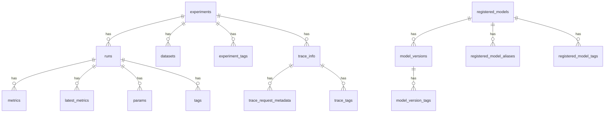
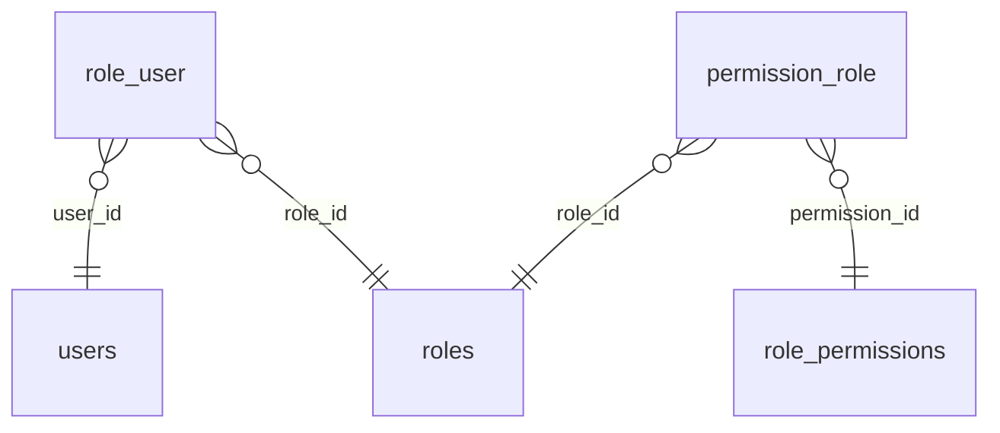

# Schema diagrams — reverse-engineered from the live database

:::note Proof of concept, generated from reality
The diagram below was **not drawn by hand**. It was produced by reading the **live `mlflow`
PostgreSQL database** (on `postgresql-ai`) and detecting its tables + foreign-key relationships —
the *reverse-engineering* pattern. Generated inside the cluster using existing credentials; **nothing
was uploaded to any third-party service**. Snapshot: **2026-10-06**. Companion to the
[Data stores inventory](data-stores-inventory) (which lists *where* every database is — this shows
*what's inside* one).
:::

## Example — the MLflow tracking database

**How to read it:** each line is a real relationship found in the database; `||--o{` means
**"one has many."** So an **experiment** has many **runs**; each **run** has many **metrics**,
**params** and **tags**; a **registered_model** has many **model_versions**; a **trace** has many
**tags/metadata**. That is exactly how MLflow stores experiment-tracking data — discovered
automatically, not documented by hand.

## Why generate diagrams this way

| Hand-drawn diagram | Reverse-engineered (this) |
|---|---|
| Correct the day it's drawn, then **rots** on the next migration | **Always matches reality** — re-reads the live schema |
| Lives in someone's desktop tool, unversioned | **Committed to Git**, rendered on this site |
| Manual effort per change | Regenerated in seconds / in CI |

## Pilot done — `tbls`, both engines ✅

The intro diagram above was first hand-built via SQL to prove the idea; the generation is now done
properly with [`tbls`](https://github.com/k1LoW/tbls), piloted across **both database engines** we run:

- **Postgres** — `mlflow` (19 tables): full column-level ERD with exact FK rules (incl. `ON UPDATE/DELETE CASCADE`).
- **MySQL/MariaDB** — `BookStack` (~40 tables): `tbls` produced entities **with columns + types + PK markers**
  plus the role/permission relationships, e.g.:

The reusable generator is committed at **`minicloud-ops/scripts/db-erd/generate-erd.sh`** — it
reverse-engineers any live Postgres/MySQL DB over a `kubectl port-forward` (creds read from the k8s
Secret at runtime, nothing uploaded). `tbls` also emits richer **per-table Markdown pages** and a
`tbls diff` **drift-check**.

## The plan (automate next)

The target state for every DB:

- each DB-owning repo gets an always-fresh ER doc under `docs/data-model/` (the SDD data-design
  artefact — see the [CNPG standard](../developer-platform/cnpg-standard));
- CI can **fail the build on schema drift** (live schema ≠ committed migrations), so docs can't lie;
- most valuable for the large **adopted/vendor** schemas (ERPNext, GLPI, BookStack, Authentik…) that
  have no hand-authored ERD.

Interactive inspection/debugging of a live DB is a separate concern (a locked-down pgAdmin/Adminer or
`kubectl port-forward`); schema *changes* always go through migrations (Flyway/Alembic), never a GUI.
