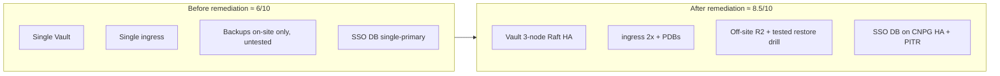

# Cluster Stability Assessment & Path to 9.5

> **Assessment snapshot — 2026-09-23**, taken immediately after the reliability-remediation
> programme (off-site DR, HA hardening, Vault Raft HA, tested restore drills, and the Authentik
> database cutover to CloudNativePG). This page is the honest, evidence-based stability rating of the
> platform **as it stands today** plus the concrete plan to close the remaining gaps.

## Score: **~8.5 / 10** — for what it actually is

A from-scratch, **bare-metal, 6-node k3s platform** on 5 second-hand ThinkPads + one 2012 MacBook Pro,
driven entirely by GitOps. That is genuinely high for its class. Two honest caveats frame the number:

- The 8.5 is a grade **as a self-hosted / portfolio platform**. Graded as *"run a regulated bank on
  this,"* it is more like a **6.5** — capped by single-site, single-control-plane, and consumer hardware.
- It is **8.5 _now_**. Before this week's remediation it was closer to a **6** (single Vault, single
  ingress, no off-site data, untested restore, single-primary SSO DB).

## What earns the score (the strong parts)

- **Day-to-day it stays up and self-heals.** Longhorn auto-failover, Argo CD `selfHeal`, KEDA + health
  probes, node-problem-detector. Incidents happen, but the platform recovers.
- **Detection is excellent.** SLO recording/alerting rules, a **dead-man's switch** (healthchecks.io),
  and **out-of-band SES alerting** — it *tells you* when something breaks, even mid-incident.
- **HA now exists where it counts.** Vault **3-node Raft**, ingress **2×** + PodDisruptionBudgets,
  Alertmanager **2×**, Cilium operator **2×**, and the SSO database (Authentik) on a **2-node
  CloudNativePG** cluster with off-site PITR.
- **Recoverable.** Off-site **Cloudflare R2** backups (volume data + Kine control-plane state) + a
  **tested restore drill** + a **scripted control-plane rebuild** — the difference between "hope" and DR.
- **Strong guardrails.** Gatekeeper deny policies, signed images + SBOM, default-deny NetworkPolicies,
  CODEOWNERS-gated GitOps.

## What caps it below ~9 (honest, structural)

- **Single k3s control plane** (SQLite/Kine on `set-hog`). Its loss was made a *bounded, drilled* event
  (tested restore + scripted rebuild) — but it is still **one node**. True embedded-etcd HA is deferred.
- **Single site + single power/network domain.** A power blip, or the controller (NAT + MinIO + Cloudflare
  tunnel) going down, still hits everything at once.
- **Aging, heterogeneous hardware** — especially `swift-mac` (a 2012 MacBook), a documented weak link.
  Consumer disks/RAM, no ECC, no redundant power.
- **Single ingress VIP** — 2 controller replicas now sit behind it, but it is one L2-announced address.

:::note These are physics, not engineering-quality gaps
The remaining points are **not** about how the platform is built (that discipline is already high) — they
are the cost of **one site, one control-plane node, and old hardware**. Those are *expensive*, not *hard*,
to fix.
:::

---

# Path to ~9.5 — Resolution Plan

Three moves close the structural gaps. Each is scoped with options, a recommendation, effort, cost, and
risk. They are independent and can be done in any order; **#2 is the cheapest immediate win**.

## 1. Remove the control-plane SPOF → 3-server embedded-etcd HA

**Goal:** eliminate the single k3s control plane so the loss of one server node no longer stops the API.

**Hard constraint:** k3s has **no in-place SQLite→embedded-etcd migration** and you cannot add a second
server to a SQLite datastore. So HA is a **planned rebuild**, not a config toggle.

| Option | What | Effort | Downtime | Recommendation |
|---|---|---|---|---|
| **A — 3-server embedded-etcd HA** | Promote 3 nodes to servers (`--cluster-init` on the first, `--server` join on the other two), front the API with a **Cilium L2 VIP** (or kube-vip) and repoint `cilium k8sServiceHost` to it. Odd quorum of 3 tolerates 1 server loss. | **High** | A maintenance window (workers keep running; API blips during the rebuild) | ✅ **Target** when 3 capable server nodes are free |
| **B — Single server + tested restore** *(current)* | Keep one server; rely on the off-site Kine backup + the scripted `restore-control-plane.yml` drill. Converts a *catastrophic* SPOF into a *bounded-RTO* event. | Low (done) | n/a | Interim floor — already in place |
| **C — External HA datastore** | Point Kine at a replicated external Postgres. | Medium | n/a | ❌ Not recommended — just moves the SPOF unless the DB is itself HA |

**Migration approach for A (no in-place path):** treat it as a rebuild — most cluster state is
reproducible from Git; the irreplaceable part is Kine (Secrets, CRD instances). Snapshot (Velero + Kine
backup), stand up the 3-server etcd control plane, rejoin the workers, and rehydrate from Git + Longhorn.
Validate against the existing restore drill first.

**Prerequisites:** 3 nodes with enough headroom to run control-plane components; the VIP wired into the
Cilium L2 pool. **Risk:** Medium (full control-plane rebuild) — do it in a window with the restore drill proven.

## 2. Retire / de-risk the 2012 MacBook (`swift-mac`)

**Goal:** remove the documented weak link from the critical path. `swift-mac` has a history of false
`ReadonlyFilesystem` signals, overload, and Longhorn attach wedges.

| Option | What | Effort | Cost | Recommendation |
|---|---|---|---|---|
| **A — De-weight from Longhorn** | In Longhorn, disable scheduling of **new replicas** on `swift-mac` (or drop its disk allocation / use node tags) so critical volumes (DBs, Vault) never place a replica there. Keep it as compute for stateless / non-critical pods. | **Low** | €0 | ✅ **Do now** — immediate risk cut, zero spend |
| **B — Replace with a modern node** | Swap in another ThinkPad / mini-PC / NUC (MAAS-provision + join). | Medium | ~€100–300 (used) | ✅ **Best long-term**, when budget allows |
| **C — Remove entirely** | Cordon → drain → delete; run on 5 nodes. | Low | €0 | Only if capacity is comfortable without it |

**Recommendation:** **A now** (de-weight — no cost, immediate), then **B** when a replacement is
available; **C** if the cluster has capacity headroom without it. **Risk:** Low — de-weighting only
changes replica placement; Longhorn rebalances non-disruptively.

:::tip ✅ Done — 2026-09-23 (Option A)
`swift-mac` set `allowScheduling: false` + `evictionRequested: true` in Longhorn. **All critical
DB/Vault replicas migrated off** (incl. `ktayl-prod` Postgres); no new replicas will land there. Two
re-creatable volumes (`harbor-registry`, Prometheus TSDB) finish draining in the background. `swift-mac`
remains a k8s **compute** node. *(Longhorn Node CR is runtime state, not GitOps-tracked — re-apply the
patch if the node is ever reset.)*
:::

## 3. Add a second failure domain → genuine DR

**Goal:** survive loss of the whole site / power / network domain. This is the **DORA Art. 11–12**
off-site-DR candidate already pre-vetted in `cloud-adoption.md`.

| Option | What | Effort | Cost | Recommendation |
|---|---|---|---|---|
| **A — OCI always-free ARM node** | Stand up an OCI free ARM VM in a different provider/region as (i) an off-site restore target and/or (ii) a standby k3s node — a second failure domain for DR. | Medium | **Free** (OCI always-free) | ✅ **Target** — realises the DORA Art. 11–12 story |
| **B — Off-site backup only** *(current)* | Off-site data via the R2 mirror (volumes + Kine + Velero objects). Data DR, not compute DR. | Low (done) | ~R2 free tier | Floor — already in place |
| **C — Full second-site / warm standby** | A second cluster kept in sync. | High | € | ❌ Overkill for this platform |

**Recommendation:** **A** — an OCI free node as a real second failure domain (restore target + optional
standby), documented as the DORA Art. 11–12 realisation; **B** is already the baseline floor. Stay within
the **€10/mo/provider** cap and free-tier-first rule from `cloud-adoption.md`. **Risk:** Low — additive,
off-cluster; no impact on the running platform.

:::note ⛔ Decision accepted, provisioning gated — 2026-09-23 (Option A)
ADR written: [minicloud-cloud `adr-0001-oci-dr-second-failure-domain`](https://github.com/andrelair-platform/minicloud-cloud/blob/main/docs/adr-0001-oci-dr-second-failure-domain.md)
— decision + design (A1.Flex always-free, Tailscale-join, restore-target-first) recorded. **Provisioning
is blocked on prerequisites the owner must supply**: an OCI tenancy, an API key in Vault
`secret/platform/oci`, a region with A1.Flex capacity, and an SSH key. Once those exist, the OpenTofu
module + budget alert + `tofu apply` follow (see the ADR's *Apply plan*).
:::

---

## Summary — the 9.5 checklist

| Move | Removes | Effort | Cost | Priority |
|---|---|---|---|---|
| 3-server embedded-etcd control plane | Control-plane SPOF | High | €0 (needs 3 nodes) | When hardware allows |
| De-weight / replace `swift-mac` | Weak-hardware link | Low → Medium | €0 → ~€200 | ✅ **De-weight done (2026-09-23)**; replace later |
| OCI second failure domain | Single-site / single-power SPOF | Medium | Free | ⛔ ADR accepted; provisioning gated on OCI account/creds |

**None of these are engineering-quality fixes** — the build discipline is already there. They buy down the
*physical* risks (one site, one control-plane node, old hardware) that separate a strong self-hosted
platform from a genuinely resilient one.

## Related

- [Production Stack Architecture](../developer-platform/29-production-stack-architecture.md)
- [DR Runbook](../backup-dr/04-dr-runbook.md) · [Longhorn Backup](../backup-dr/06-longhorn-backup.md) · [etcd/Kine Backup](../backup-dr/02-etcd-backup.md)
- [Chaos Mesh](./01-chaos-mesh.md) · [Chaos Game Day](./02-phase81-chaos-game-day.md)
